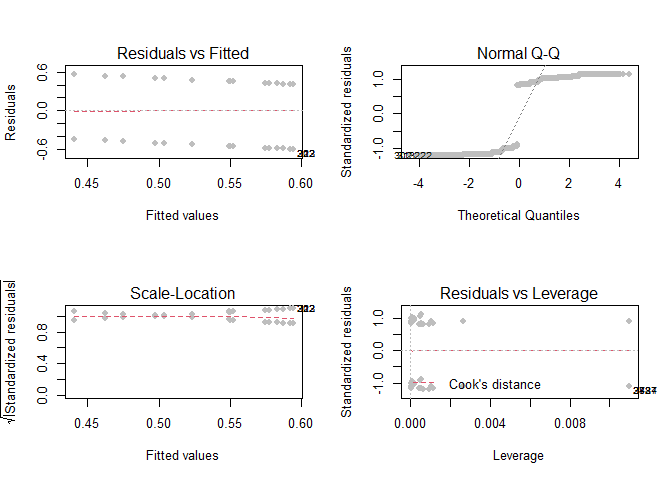

2017 practice
================
Tamires Amorim and Carol
11/23/2020

2017 Practice Exam:

### Question 1

(25 points) Please answer the following; you might find it useful to
make a sketch. a) For a Normal Distribution that has mean -7 and
standard deviation 7.1, what is the area to the right of 6.49?

``` r
pnorm(6.49,-7,7.1,lower.tail = FALSE)
```

    ## [1] 0.02871656

For a Normal Distribution that has mean 11 and standard deviation 4.1,
what is the area to the right of 6.08?

``` r
pnorm(6.08,11,4.1,lower.tail = FALSE)
```

    ## [1] 0.8849303

For a Normal Distribution that has mean 5 and standard deviation 3, what
is the area to the left of 3.5?

``` r
pnorm(3.5,5,3,lower.tail = TRUE)
```

    ## [1] 0.3085375

For a Normal Distribution that has mean -7 and standard deviation 3.8,
what is the area to the left of 1.74?

``` r
pnorm(1.74,-7,3.8,lower.tail = TRUE)
```

    ## [1] 0.9892759

For a Normal Distribution that has mean -10 and standard deviation 5.1,
what is the area to the left of -18.67?

``` r
pnorm(-18.67,-10,5.1,lower.tail = TRUE)
```

    ## [1] 0.04456546

For a Normal Distribution that has mean -10 and standard deviation 3.4,
what is the area in both tails farther from the mean than -12.04?

``` r
pnorm(-12.04,-10,3.4,lower.tail = TRUE)*2
```

    ## [1] 0.5485062

For a Normal Distribution that has mean 8 and standard deviation 8.6,
what is the area in both tails farther from the mean than -5.76?

``` r
pnorm(-5.76,8,8.6,lower.tail = TRUE)*2
```

    ## [1] 0.1095986

For a Normal Distribution that has mean 12 and standard deviation 2.2 ,
what is the area in both tails farther from the mean than 10.02 ?
Previous methods gave weird return, so I did on the online calculator
getting z= -0.9, and the area in both tails farther from the mean =
0.36812

For a Normal Distribution that has mean -5 and standard deviation 1.3
what values leave probability 0.15 in both tails?

``` r
0.15/2
```

    ## [1] 0.075

``` r
qnorm(0.075,-5,1.3,lower.tail = FALSE)
```

    ## [1] -3.128609

``` r
qnorm(0.075,-5,1.3,lower.tail = TRUE)
```

    ## [1] -6.871391

For a Normal Distribution that has mean 11 and standard deviation 7.6
what values leave probability 0.782 in both tails?

``` r
0.782/2
```

    ## [1] 0.391

``` r
qnorm(0.391,11,7.6,lower.tail = FALSE)
```

    ## [1] 13.10302

``` r
qnorm(0.391,11,7.6,lower.tail = TRUE)
```

    ## [1] 8.896976

For a Normal Distribution that has mean 9 and standard deviation 3.1
what values leave probability 0.077 in both tails?

``` r
0.782/2
```

    ## [1] 0.391

``` r
qnorm(0.391,11,7.6,lower.tail = FALSE)
```

    ## [1] 13.10302

``` r
qnorm(0.391,11,7.6,lower.tail = TRUE)
```

    ## [1] 8.896976

A regression coefficient is estimated to be equal to 6.09 with standard
error 8.7; there are 40 degrees of freedom. What is the p-value (from
the t-statistic) against the null hypothesis of zero?

Calculated on excel: 6.09/8.7 = 0.7 =T.DIST.2T(0.7,40) = 0.487979

A regression coefficient is estimated to be equal to -20.16 with
standard error 8.4; there are 34 degrees of freedom. What is the p-value
(from the t-statistic) against the null hypothesis of zero?

Calculated on excel: -20.16/8.4 = -2.4 =T.DIST.2T(-2.4,34) = 0.022017747

A regression coefficient is estimated to be equal to 8.8 with standard
error 4.4; there are 5 degrees of freedom. What is the p-value (from the
t-statistic) against the null hypothesis of zero?

Calculated on excel: 8.8/4.4 = 2 =T.DIST.2T(2,5) = 0.101939479

A regression coefficient is estimated to be equal to -17.64 with
standard error 9.8; there are 11 degrees of freedom. What is the p-value
(from the t-statistic) against the null hypothesis of zero?

Calculated on excel: -17.64/9.8 = -1.8 =T.DIST.2T(1.8,11) = 0.099315893

### Question 5:

Explain what these coefficients mean. Should we include education levels
of the head as well as the spouse?

The correlation coefficient measures the strengh of the relationship
between the X and Y variables, in this particular situation if the age
difference between the couple is large given the education attainments,
the head of the house is female, and gender role of spouse.

Calculate the estimated probability that a spouse with some college, who
is male and the head of household is female, has a large age difference.
Here the probability is 0.2956 or 29% chance that there is a relation
between the large age difference and the spouse with some college who is
male and head of the household is female.

What is the change in estimated probability if the spouse is female and
head of household is male? Here the probability is 0.3160 or 32% chance
that there is a large age difference when we switch roles, in this
specific case there is a 3% increase.

What is the change in estimated probability if, instead, the spouse gets
an advanced degree? If the spouse gets an advanced degree and is female
and the head of the household is male, there is a negative relationship
with a decrease of -0.3348 or 34% less chances of a big age difference
when the spouse is female and have an advanced college degree.

### Question 2: 2016 exam

``` r
load("~/GitHub/exam-practice/ATUS_data/ATUS_2003_2013_a.RData")
```

``` r
use_varb <- (dat2$EMPSTAT == 'Employed - at work')
dat_use <- subset(dat2,use_varb)
is.na(dat_use$EARNWEEK) <- which((dat_use$EARNWEEK == 9999999))
dat_use$EARNWEEK <- dat_use$EARNWEEK/100
dat_use$lots_social <- (dat_use$ACT_SOCIAL > 180)
attach(dat_use)
```

``` r
fit <- lm(lots_social ~  EDUC, data = dat_use)
summary(fit)
```

    ## 
    ## Call:
    ## lm(formula = lots_social ~ EDUC, data = dat_use)
    ## 
    ## Residuals:
    ##     Min      1Q  Median      3Q     Max 
    ## -0.5943 -0.5237  0.4127  0.4477  0.5595 
    ## 
    ## Coefficients:
    ##                                                         Estimate Std. Error
    ## (Intercept)                                            0.5494505  0.0521194
    ## EDUC"1st, 2nd, 3rd, or 4th grade"                     -0.0001172  0.0581001
    ## EDUC"5th or 6th grade"                                 0.0004969  0.0545561
    ## EDUC"7th or 8th grade"                                 0.0422654  0.0544079
    ## EDUC"9th grade"                                        0.0448199  0.0536761
    ## EDUC"10th grade"                                       0.0336955  0.0534351
    ## EDUC"11th grade"                                       0.0378213  0.0532175
    ## EDUC"12th grade - no diploma"                          0.0249439  0.0547864
    ## EDUC"High school graduate - GED"                       0.0379736  0.0534114
    ## EDUC"High school graduate - diploma"                   0.0275720  0.0522373
    ## EDUC"Some college but no degree"                       0.0028938  0.0522638
    ## EDUC"Associate degree - occupational vocational"      -0.0257451  0.0526350
    ## EDUC"Associate degree - academic program"             -0.0453628  0.0526271
    ## EDUC"Bachelor's degree (BA, AB, BS, etc.)"            -0.0516851  0.0522345
    ## EDUC"Master's degree (MA, MS, MEng, MEd, MSW, etc.)"  -0.0743859  0.0523976
    ## EDUC"Professional school degree (MD, DDS, DVM, etc.)" -0.0869505  0.0533927
    ## EDUC"Doctoral degree (PhD, EdD, etc.)"                -0.1089744  0.0534469
    ##                                                       t value Pr(>|t|)    
    ## (Intercept)                                            10.542   <2e-16 ***
    ## EDUC"1st, 2nd, 3rd, or 4th grade"                      -0.002   0.9984    
    ## EDUC"5th or 6th grade"                                  0.009   0.9927    
    ## EDUC"7th or 8th grade"                                  0.777   0.4373    
    ## EDUC"9th grade"                                         0.835   0.4037    
    ## EDUC"10th grade"                                        0.631   0.5283    
    ## EDUC"11th grade"                                        0.711   0.4773    
    ## EDUC"12th grade - no diploma"                           0.455   0.6489    
    ## EDUC"High school graduate - GED"                        0.711   0.4771    
    ## EDUC"High school graduate - diploma"                    0.528   0.5976    
    ## EDUC"Some college but no degree"                        0.055   0.9558    
    ## EDUC"Associate degree - occupational vocational"       -0.489   0.6248    
    ## EDUC"Associate degree - academic program"              -0.862   0.3887    
    ## EDUC"Bachelor's degree (BA, AB, BS, etc.)"             -0.989   0.3224    
    ## EDUC"Master's degree (MA, MS, MEng, MEd, MSW, etc.)"   -1.420   0.1557    
    ## EDUC"Professional school degree (MD, DDS, DVM, etc.)"  -1.629   0.1034    
    ## EDUC"Doctoral degree (PhD, EdD, etc.)"                 -2.039   0.0415 *  
    ## ---
    ## Signif. codes:  0 '***' 0.001 '**' 0.01 '*' 0.05 '.' 0.1 ' ' 1
    ## 
    ## Residual standard error: 0.4972 on 88928 degrees of freedom
    ## Multiple R-squared:  0.006995,   Adjusted R-squared:  0.006816 
    ## F-statistic: 39.15 on 16 and 88928 DF,  p-value: < 2.2e-16

``` r
require(stargazer)
```

    ## Loading required package: stargazer

    ## 
    ## Please cite as:

    ##  Hlavac, Marek (2018). stargazer: Well-Formatted Regression and Summary Statistics Tables.

    ##  R package version 5.2.2. https://CRAN.R-project.org/package=stargazer

``` r
stargazer(fit, type = "text")
```

    ## 
    ## =================================================================================
    ##                                                           Dependent variable:    
    ##                                                       ---------------------------
    ##                                                               lots_social        
    ## ---------------------------------------------------------------------------------
    ## EDUC"1st, 2nd, 3rd, or 4th grade"                               -0.0001          
    ##                                                                 (0.058)          
    ##                                                                                  
    ## EDUC"5th or 6th grade"                                          0.0005           
    ##                                                                 (0.055)          
    ##                                                                                  
    ## EDUC"7th or 8th grade"                                           0.042           
    ##                                                                 (0.054)          
    ##                                                                                  
    ## EDUC"9th grade"                                                  0.045           
    ##                                                                 (0.054)          
    ##                                                                                  
    ## EDUC"10th grade"                                                 0.034           
    ##                                                                 (0.053)          
    ##                                                                                  
    ## EDUC"11th grade"                                                 0.038           
    ##                                                                 (0.053)          
    ##                                                                                  
    ## EDUC"12th grade - no diploma"                                    0.025           
    ##                                                                 (0.055)          
    ##                                                                                  
    ## EDUC"High school graduate - GED"                                 0.038           
    ##                                                                 (0.053)          
    ##                                                                                  
    ## EDUC"High school graduate - diploma"                             0.028           
    ##                                                                 (0.052)          
    ##                                                                                  
    ## EDUC"Some college but no degree"                                 0.003           
    ##                                                                 (0.052)          
    ##                                                                                  
    ## EDUC"Associate degree - occupational vocational"                -0.026           
    ##                                                                 (0.053)          
    ##                                                                                  
    ## EDUC"Associate degree - academic program"                       -0.045           
    ##                                                                 (0.053)          
    ##                                                                                  
    ## EDUC"Bachelor's degree (BA, AB, BS, etc.)"                      -0.052           
    ##                                                                 (0.052)          
    ##                                                                                  
    ## EDUC"Master's degree (MA, MS, MEng, MEd, MSW, etc.)"            -0.074           
    ##                                                                 (0.052)          
    ##                                                                                  
    ## EDUC"Professional school degree (MD, DDS, DVM, etc.)"           -0.087           
    ##                                                                 (0.053)          
    ##                                                                                  
    ## EDUC"Doctoral degree (PhD, EdD, etc.)"                         -0.109**          
    ##                                                                 (0.053)          
    ##                                                                                  
    ## Constant                                                       0.549***          
    ##                                                                 (0.052)          
    ##                                                                                  
    ## ---------------------------------------------------------------------------------
    ## Observations                                                    88,945           
    ## R2                                                               0.007           
    ## Adjusted R2                                                      0.007           
    ## Residual Std. Error                                       0.497 (df = 88928)     
    ## F Statistic                                           39.152*** (df = 16; 88928) 
    ## =================================================================================
    ## Note:                                                 *p<0.1; **p<0.05; ***p<0.01

``` r
par(mfrow=c(2,2))
plot(fit,col="grey",pch=16,cex=1,lwd=1,lty=2)
```

<!-- -->

When trying to restrict the data to only higher educational attainments
the size of the data to be analyzed in the regression did not match, the
way arounf it, was to run the regression with all the educational
levels, as observed those coefficients are not statistically
significant, given that most likely because students do not have time to
have leisure. Although, when subsetting the data we chose working
people, which explains why most of the lower grade are not significant.
